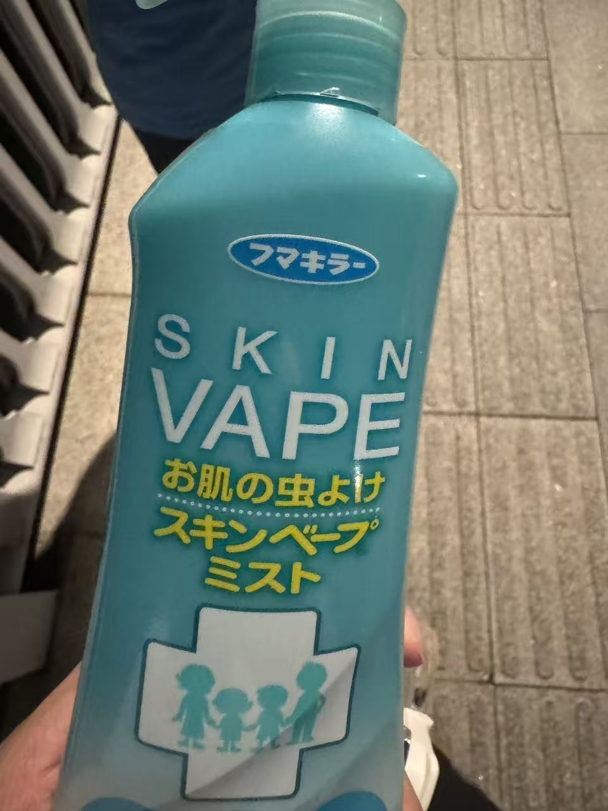

# 「日常图片で学ぶ日本語」示例课：虫よけスプレー

> 一张日常照片能挖出多少词？这课用一张驱蚊喷雾的照片，示范「图片日语」怎么用：
> 看图 → 抠单词 → 拆语法 → 造句式。课件就是这份 markdown，写完跑一次
> `python practice/import_picture_lesson.py 课件.md --id lesson_demo --write`
> 就变成网页里能上的课。换成你自己的照片与文字，就是你的第一课。

---

## 写真1：虫よけスプレー

**包装上的字：**
> お肌の虫よけ
> ミストタイプ
> 子供用もあります

### 核心单词

| 单词 | 假名 | 释义 |
|---|---|---|
| 虫よけ | むしよけ | 驱蚊，防虫（虫＋除け） |
| スプレー | すぷれー | 喷雾，喷雾器 |
| ミスト | みすと | 喷雾，水雾（比スプレー更细） |
| お肌 | おはだ | 肌肤（「肌」的美化说法） |
| 子供用 | こどもよう | 儿童用 |
| 成分 | せいぶん | 成分 |
| 使う | つかう | 使用，用 |

### 语法：～の～（……用的……）

「名词 + の + 名词」表示用途、所属或性质。照片里最典型的一处就是「お肌**の**虫よけ」。

- お肌**の**虫よけ ＝ 肌肤用的驱蚊液
- 子供**の**虫よけ ＝ 孩子用的驱蚊液
- 虫よけ**スプレー** ＝ 驱蚊喷雾（名词叠加成复合词）
- 私**の**もの ＝ 我的东西（所属）

### 实用句式：～用 / ～タイプ / ～にやさしい

- 子供**用** ＝ 儿童用的
- ミスト**タイプ** ＝ 喷雾型
- お肌**にやさしい** ＝ 对肌肤温和

---

## まとめ

### 本课核心语法

1. **～の～** — ……的……（用途、所属、性质）
2. **～用** — 供……用的（子供用、大人用）
3. **～タイプ** — ……型（ミストタイプ）
4. **お＋名词** — 美化语（お肌、お水）

### 本课核心单词

虫よけ、スプレー、ミスト、お肌、子供用、成分、使う

---

## 練習

**1. 看图说出这些词：**
- 驱蚊（　）
- 喷雾（　）
- 肌肤（　）
- 成分（　）

**2. 用「～の～」把两组词连成一句话：**
- お肌 ／ 虫よけ
- 子供 ／ 虫よけ
- 虫 ／ スプレー

**3. 翻译下面的句子：**
- 这是儿童用的驱蚊喷雾。（子供用／虫よけスプレー）
- 这个对肌肤很温和。（肌にやさしい）
